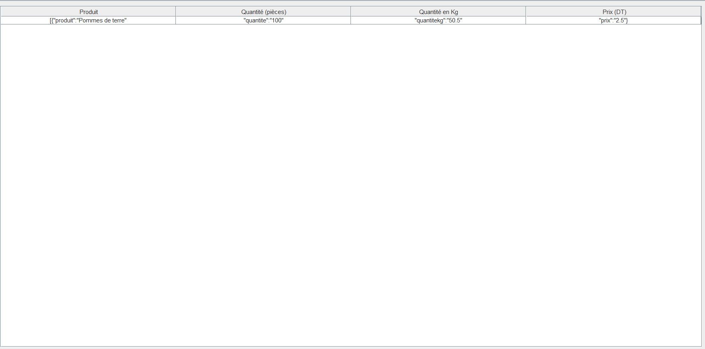
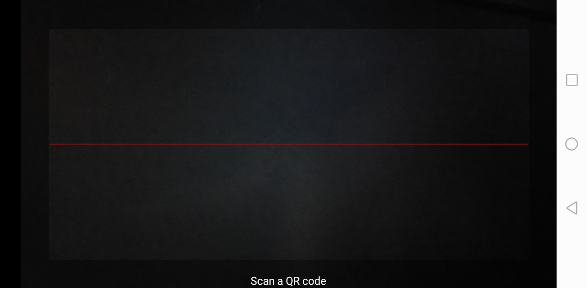

Restaurant App
Overview

The Restaurant App is a comprehensive solution for managing restaurant operations, including viewing menus, placing orders, and handling reservations. It consists of a web application (Suing) for restaurant management and an Android mobile application for customer interaction. The system communicates with a PHP API, which interacts with the database to store and retrieve data.

Features

    Menu Viewing: Customers can browse the restaurant's menu and view details of dishes.
    Order Placement: Users can place orders directly from the Android app.
    Reservation Management: Restaurant staff can manage reservations and table assignments through the Suing web application.
    Communication with Database: The PHP API facilitates communication between the Suing app and the database, ensuring seamless data transfer.

## Screenshots
### Album 1: Super Admin 'Boss' Management

### Album 2:  Admin Cashier

*Dashboard of the Suing  application.*

### Album 3:  Client 
this Android Application in this Link copy it :https://github.com/abdelkarimse/AbdroidResteau

*Menu management interface in the Suing app.*

### Album 2: Order Tracking and Reservation Management

*Order tracking interface in the Suing app.*

Dashboard of the Suing  application.

Menu management interface in the Suing app.
Android App

Home screen of the Android app, displaying featured dishes.

Menu view in the Android app.
Technologies Used

    Frontend: Suing  app, Java Android app
    Backend: Java
    Api:Php
    Database: MySQL

Installation

    Clone the repository: git clone https://github.com/ResteauApp.git
    Set up the database by importing the provided SQL schema.
    Configure the PHP API to connect to your database by updating the configuration file (config.php).

Usage
Suing  Application

    Navigate to the Suing web application directory.
    Start the server (e.g., using PHP's built-in server): php -S localhost:8000
    Access the application in your web browser: http://localhost:8000

Android App

    Open the Android project in Android Studio.
    Build and run the project on an Android emulator or physical device.

API Documentation

Detailed documentation for the PHP API endpoints can be found here.
Contributors

    John Doe (@johndoe)
    Jane Smith (@janesmith)

License

This project is licensed under the MIT License.
Support

For any inquiries or support requests, please contact us at selmi.abdelkarim2@gmail.com
